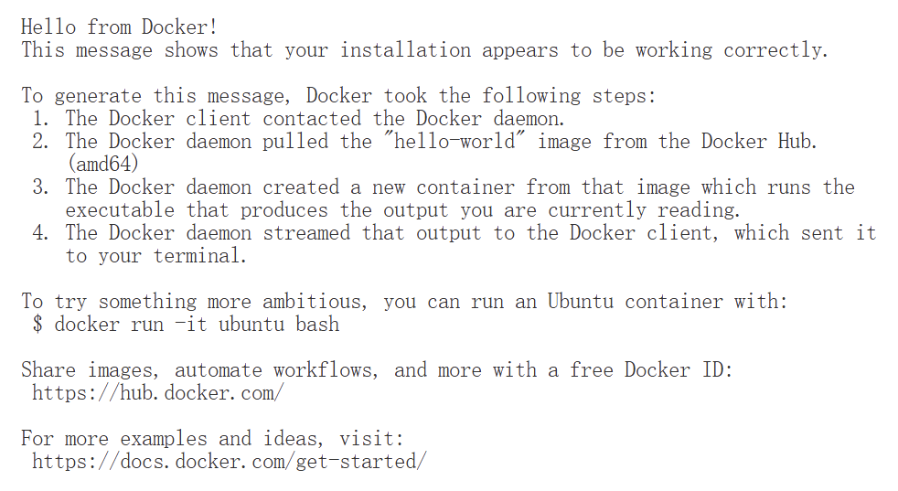

# Run with Docker (Development Mode)

## Prerequisites
These prerequisites are already installed if you are using innowing's computer. 

If you are using your own server, please follow the steps below to install the prerequisites:

### Docker and Docker Compose installed
- Install on [linux](https://docs.docker.com/engine/install/)
- Install on [Windows](https://docs.docker.com/desktop/install/windows-install/)
- Install on [Mac](https://docs.docker.com/desktop/install/mac-install/)


To check your docker installation, run:
```bash
docker run hello-world
```
If you see the following message, then your installation is working correctly:


### NVIDIA GPU Support Required (if you want to use cpu only, skip this):
- NVIDIA GPU with CUDA support
  - For [Windows](https://docs.nvidia.com/cuda/cuda-installation-guide-microsoft-windows/)
  - For [Linux](https://docs.nvidia.com/cuda/cuda-installation-guide-linux/)
- NVIDIA Container Toolkit installed
  - For [Windows](https://docs.nvidia.com/datacenter/cloud-native/container-toolkit/install-guide.html#docker) you need to install the NVIDIA Container Toolkit in wsl.
  - For [Linux](https://docs.nvidia.com/datacenter/cloud-native/container-toolkit/install-guide.html#docker)

## Quick Start
### Make sure the docker daemon is running
In innowing's environment, you can double-click the Docker Desktop icon to start the daemon.


If you are using your own Linux server, run:
```bash
sudo systemctl start docker
```
### Prepare the application code
```bash
# Unzip the application files
unzip mtr-chatbot.zip

# Navigate to the application directory
cd mtr-chatbot
```
### Run with gpu
We use a smaller model compared to the one used on production, which is more suitable for single GPU but the performance will be lower than the larger model.
```bash
# Run in detached mode
docker compose up -d --build

# Pull necessary Ollama models (example)
docker exec -it mtr-ollama ollama pull deepseek-r1:8b
```
Now you can access the application at http://localhost:8501

#### Verify GPU Usage in Ollama
```bash
# Check if Ollama is using nvidia GPU
docker exec mtr-ollama nvidia-smi
```

### Or run with cpu only (not recommended)
For testing purposes only, we will use a much smaller model, which is more suitable for CPU usage but the performance will be significantly lower.
```bash
# Run in detached mode
docker compose -f docker-compose.cpu.yml up -d --build

# Pull necessary Ollama models (example)
docker exec -it mtr-ollama ollama pull deepseek-r1:1.5b
```
Now you can access the application at http://localhost:8501


## View the logs
```bash
# view the logs
docker compose logs -f
# view the chatbot logs only
docker compose logs -f chatbot
```

## Change Models
You can change the models used by modifying the `docker-compose.yml` or `docker-compose.cpu.yml` file. 

For example, to change the model for Ollama, update the `OLLAMA_CHAT_MODEL` environment variable in the `ollama` service section:


After making changes to the `docker-compose.yml` or `docker-compose.cpu.yml` file, restart the services:
```bash
docker compose restart ollama chatbot
```

After restarting the services, pull required models:
```bash
docker exec mtr-ollama ollama pull deepseek-r1:8b
docker exec mtr-ollama ollama pull qwen3:8b
docker exec mtr-ollama ollama pull llama3.1:8b
# or any other model you need
```

